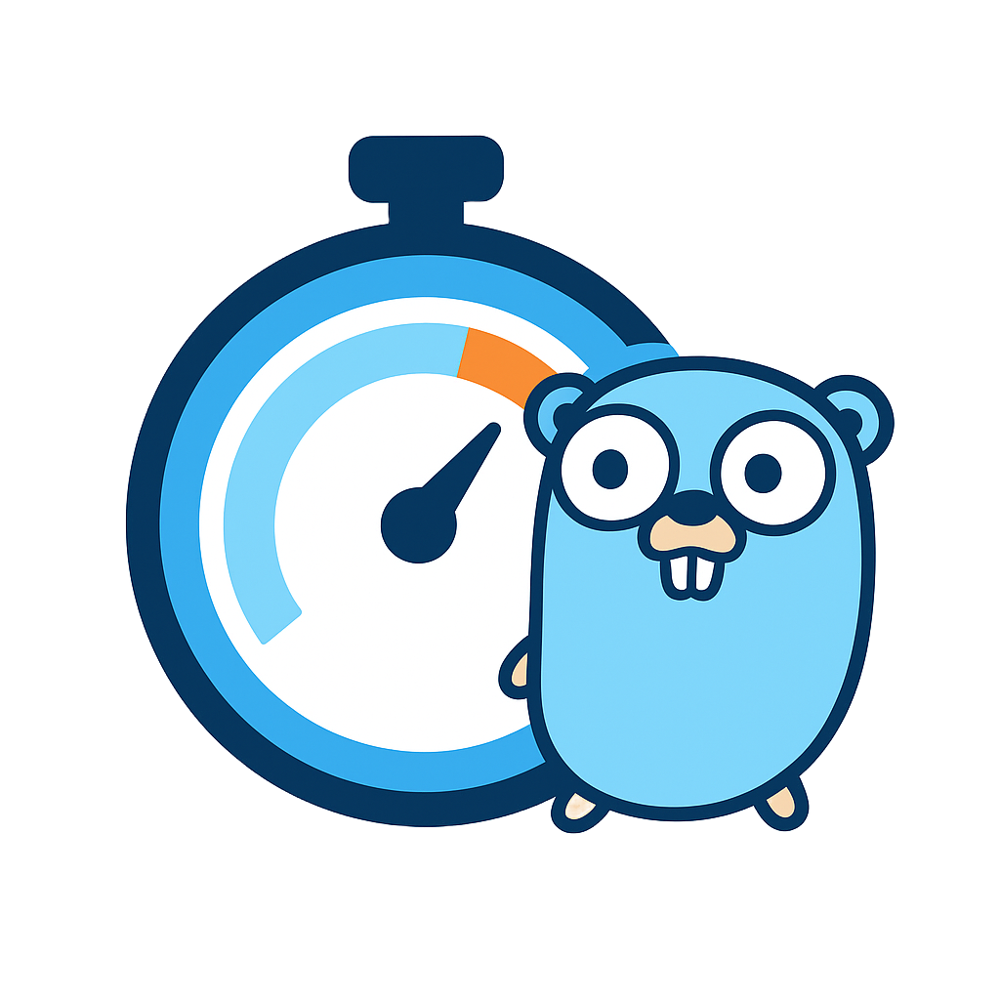

# Go Rate Limiter

<p align="center">
  
</p>

A production-ready, distributed rate limiter middleware for Go services. Built with a Redis backend for horizontal scalability and an in-memory fallback for local development.

## Features

- **Distributed Rate Limiting** – Share limits across multiple service instances via Redis.
- **Thread-Safe** – Safely handles concurrent requests with atomic operations.
- **Flexible Key Extraction** – Rate limit by IP, user ID, API key, or custom logic.
- **Atomic Operations** – Lua scripts prevent race conditions in Redis.
- **Timeout Protection** – Respects context timeouts and prevents request hangs.
- **Fallback Support** – In-memory repository for testing without Redis.
- **Production-Ready** – Comprehensive tests, proper error handling, and observability.

## Installation

```bash
go get github.com/dimmig/go-rate-limiter
````

## Quick Start

### 1. Setup Redis

**Using Docker (Recommended):**

```bash
docker run --name redis-local -p 6379:6379 -d redis:latest
```

**Using Homebrew (macOS):**

```bash
brew install redis
redis-server
```

**Using apt (Linux):**

```bash
sudo apt-get install redis-server
redis-server
```

### 2. Basic Usage

```go
package main

import (
    "github.com/gin-gonic/gin"
    "go-rate-limiter/middleware"
)

func main() {
    r := gin.Default()

    // Create rate limiter: 100 requests per 60 seconds per IP
    rateLimitMW := middleware.NewRateLimiterConfig(
        func(c *gin.Context) string {
            return c.ClientIP()
        },
        100,  // limit
        60,   // window (seconds)
    )

    // Apply to all routes
    r.Use(middleware.NewRateLimiter(rateLimitMW))

    r.GET("/api/data", func(c *gin.Context) {
        c.JSON(200, gin.H{"message": "success"})
    })

    r.Run(":8080")
}
```

### 3. Test It

```bash
# Start your app
go run main.go

# In another terminal, make requests
curl http://localhost:8080/api/data
curl http://localhost:8080/api/data
# ... after 100 requests in 60 seconds:
curl http://localhost:8080/api/data
# Returns: {"error":"rate limit exceeded"} with 429 status
```

Other examples can be found in the `/examples` folder.

---

## Configuration

### Rate Limiter Config

```go
type RateLimiterConfig struct {
    Limiter *service.LimiterService     // Rate limiter instance
    KeyFunc func(*gin.Context) string   // Function to extract key
    Limit   int                         // Max requests allowed
    Window  int                         // Time window in seconds
}
```

### Tuning

**For Public APIs:**

```go
Limit:  10
Window: 60  // 10 requests per minute
```

**For Authenticated APIs:**

```go
Limit:  1000
Window: 60  // 1000 requests per minute
```

**For Internal Services:**

```go
Limit:  10000
Window: 60  // 10000 requests per minute
```

**For Login Endpoints:**

```go
Limit:  5
Window: 60  // 5 attempts per minute
```

---

## License

MIT
